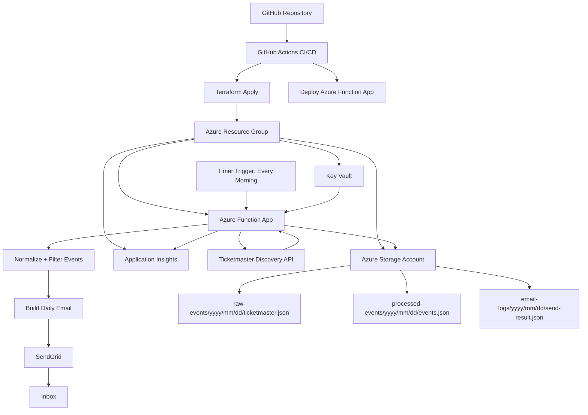
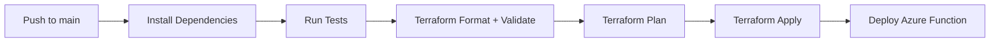

# Chicago Event Pulse MVP

Chicago Event Pulse is a daily email digest that finds events happening in Chicago today and sends a curated list every morning.

The MVP uses one event API, stores raw and processed event data in Azure Storage, runs on Azure Functions, sends email through SendGrid, and deploys through GitHub Actions with Terraform-managed infrastructure.

## MVP Decision

For the first version, use the **Ticketmaster Discovery API**.

Why Ticketmaster first:

- Strong coverage for concerts, sports, theater, comedy, and major venues.
- Simple location and date filters.
- Clean API response structure for normalizing events.
- Good fit for a portfolio-ready Azure serverless project.

Email provider: **SendGrid**

Infrastructure as Code: **Terraform**

Cloud provider: **Azure**

## MVP Goals

- Run a scheduled job every morning.
- Fetch Chicago events for the current day from Ticketmaster.
- Normalize events into a simple internal JSON format.
- Save raw API responses to Azure Blob Storage.
- Save processed event summaries to Azure Blob Storage.
- Generate a readable HTML email.
- Send the daily digest through SendGrid.
- Log function runs and failures with Application Insights.
- Deploy application and infrastructure through CI/CD.

## Non-Goals For MVP

- Multiple event APIs.
- User accounts.
- A public web dashboard.
- Personalized preferences.
- AI-generated summaries.
- Paid subscription support.
- Complex ranking or recommendation logic.

These can come after the first working daily email.

## Architecture



## System Pattern

This project follows a scheduled serverless ETL and notification pattern.

1. **Extract**
   - Azure Function calls the Ticketmaster Discovery API.

2. **Transform**
   - Events are filtered to Chicago and today.
   - API-specific fields are normalized into a common event shape.

3. **Load**
   - Raw API responses and processed JSON are saved to Azure Blob Storage.

4. **Notify**
   - The function builds an HTML email and sends it through SendGrid.

## Azure Resources

Terraform should create:

- Azure Resource Group
- Azure Storage Account
- Blob containers:
  - `raw-events`
  - `processed-events`
  - `email-logs`
- Azure Function App
- Linux Consumption Plan
- Application Insights
- Log Analytics Workspace
- Azure Key Vault
- Managed identity for the Function App
- Role assignments so the Function App can read secrets and write blobs

## Secrets

Store these in Azure Key Vault:

- `TICKETMASTER-API-KEY`
- `SENDGRID-API-KEY`
- `DAILY-EMAIL-TO`
- `DAILY-EMAIL-FROM`

The Function App should use managed identity to read the secrets at runtime.

## Repo Structure

```text
chicago-event-pulse/
  .github/
    workflows/
      deploy.yml

  src/
    functions/
      daily_events_timer.py
    services/
      event_sources/
        ticketmaster.py
      email_service.py
      storage_service.py
      formatter.py
      ranking.py
    models/
      event.py
    config.py

  tests/
    test_formatter.py
    test_ranking.py
    test_ticketmaster_normalization.py

  infra/
    main.tf
    variables.tf
    outputs.tf
    providers.tf
    terraform.tfvars.example

  MVP.md
  README.md
  requirements.txt
  host.json
  local.settings.json.example
```

## Event Model

The app should normalize Ticketmaster events into this shape:

```json
{
  "title": "Chicago Bulls vs. Milwaukee Bucks",
  "date": "2026-04-19",
  "start_time": "19:00",
  "venue": "United Center",
  "address": "1901 W Madison St, Chicago, IL",
  "category": "Sports",
  "price_min": 35,
  "price_max": 180,
  "url": "https://example.com/event",
  "source": "Ticketmaster"
}
```

## Daily Function Flow

1. Timer trigger starts the function.
2. Function loads secrets from Key Vault.
3. Function calls Ticketmaster for Chicago events happening today.
4. Raw Ticketmaster response is saved to Blob Storage.
5. Events are normalized into the internal event model.
6. Events are lightly ranked.
7. Processed event JSON is saved to Blob Storage.
8. HTML email is generated.
9. Email is sent with SendGrid.
10. Send result is saved to Blob Storage.
11. Errors and metrics are logged to Application Insights.

## CI/CD Flow



GitHub Actions should use Azure federated credentials or a GitHub Actions secret-based service principal.

For a clean MVP, start with a service principal stored in GitHub Secrets, then upgrade to OIDC later.

Required GitHub Secrets:

- `AZURE_CREDENTIALS`
- `AZURE_SUBSCRIPTION_ID`
- `SENDGRID_API_KEY`
- `TICKETMASTER_API_KEY`
- `DAILY_EMAIL_TO`
- `DAILY_EMAIL_FROM`

`AZURE_CREDENTIALS` should be the JSON credentials object for an Azure service principal.

## Terraform Variables

Initial variables:

```hcl
variable "project_name" {
  type        = string
  description = "Project name used for Azure resource naming."
  default     = "chicago-event-pulse"
}

variable "location" {
  type        = string
  description = "Azure region."
  default     = "eastus"
}

variable "environment" {
  type        = string
  description = "Deployment environment."
  default     = "dev"
}
```

Secret variables:

```hcl
variable "ticketmaster_api_key" {
  type        = string
  description = "Ticketmaster Discovery API key."
  sensitive   = true
}

variable "sendgrid_api_key" {
  type        = string
  description = "SendGrid API key."
  sensitive   = true
}

variable "daily_email_to" {
  type        = string
  description = "Daily digest recipient email address."
  sensitive   = true
}

variable "daily_email_from" {
  type        = string
  description = "Verified SendGrid sender email address."
  sensitive   = true
}
```

## MVP Email Format

Subject:

```text
Today's Chicago Events - April 19, 2026
```

Body sections:

```text
Top Chicago Events Today

1. Event title
   Venue
   Time
   Category
   Price range
   Link
```

Keep the first version simple:

- Maximum 10 events.
- Sort by start time, then by category.
- Include venue, time, category, price if available, and link.
- Include a short footer with the data source and run timestamp.

## Local Development

Expected local workflow:

```bash
python -m venv .venv
source .venv/bin/activate
pip install -r requirements.txt
pytest
func start
```

The local function should read settings from `local.settings.json`.

Do not commit real secrets. Use `local.settings.json.example` for placeholder values.

## Build Checklist

- [ ] Create Python Azure Functions project.
- [ ] Add Timer Trigger function.
- [ ] Add Ticketmaster API client.
- [ ] Add event normalization model.
- [ ] Add Blob Storage writer.
- [ ] Add SendGrid email sender.
- [ ] Add HTML email formatter.
- [ ] Add unit tests for normalization and formatting.
- [ ] Add Terraform Azure infrastructure.
- [ ] Add GitHub Actions workflow.
- [ ] Deploy to Azure dev environment.
- [ ] Confirm daily email delivery.

## Stretch Goals

- Add Chicago open data events.
- Add Eventbrite or SeatGeek as a second source.
- Add deduplication across event sources.
- Add neighborhood filters.
- Add free-event section.
- Add weather-aware outdoor event highlighting.
- Add HTTP-triggered preview endpoint.
- Add a simple static dashboard for previous digests.
- Move GitHub Actions authentication from service principal secrets to OIDC.
