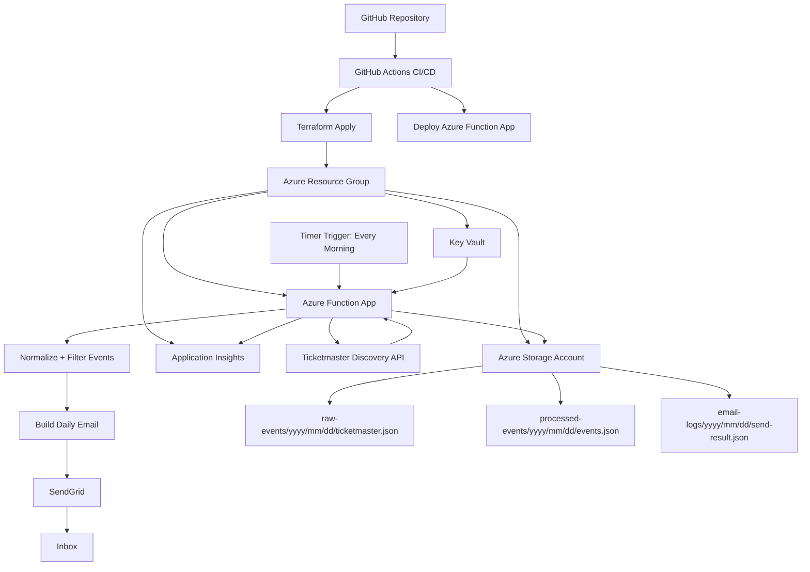
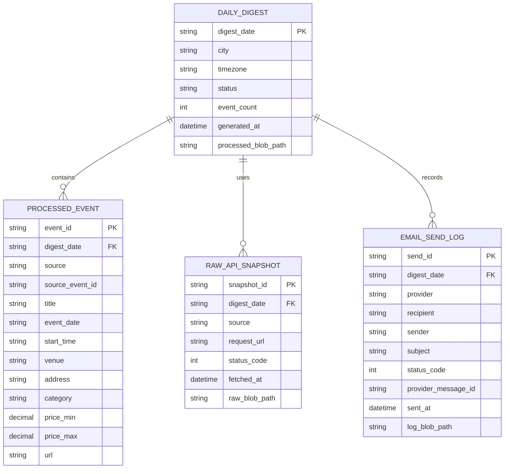
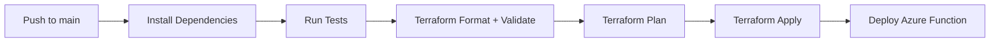

# Chicago Event Pulse MVP

Chicago Event Pulse is a daily email digest that finds events happening in Chicago today and sends a curated list every morning.

The MVP uses one event API, stores raw and processed event data in Azure Storage, runs on Azure Functions, sends email through SendGrid, and deploys through GitHub Actions with Terraform-managed infrastructure.

## MVP Decision

For the first version, use the **Ticketmaster Discovery API**.

Why Ticketmaster first:

- Strong coverage for concerts, sports, theater, comedy, and major venues.
- Simple location and date filters.
- Clean API response structure for normalizing events.
- Good fit for a portfolio-ready Azure serverless project.

Email provider: **SendGrid**

Infrastructure as Code: **Terraform**

Cloud provider: **Azure**

## MVP Goals

- Run a scheduled job every morning.
- Fetch Chicago events for the current day from Ticketmaster.
- Normalize events into a simple internal JSON format.
- Save raw API responses to Azure Blob Storage.
- Save processed event summaries to Azure Blob Storage.
- Generate a readable HTML email.
- Send the daily digest through SendGrid.
- Log function runs and failures with Application Insights.
- Deploy application and infrastructure through CI/CD.

## Non-Goals For MVP

- Multiple event APIs.
- User accounts.
- A public web dashboard.
- Personalized preferences.
- AI-generated summaries.
- Paid subscription support.
- Complex ranking or recommendation logic.

These can come after the first working daily email.

## Architecture



## System Pattern

This project follows a scheduled serverless ETL and notification pattern.

1. **Extract**
   - Azure Function calls the Ticketmaster Discovery API.

2. **Transform**
   - Events are filtered to Chicago and today.
   - API-specific fields are normalized into a common event shape.

3. **Load**
   - Raw API responses and processed JSON are saved to Azure Blob Storage.

4. **Notify**
   - The function builds an HTML email and sends it through SendGrid.

## Current Setup Status

Completed:

- GitHub repository created and connected.
- GitHub Actions workflow created.
- GitHub Actions deployment changed to manual trigger.
- Azure service principal created for GitHub Actions.
- GitHub repository secrets configured.
- Terraform remote state configured in Azure Storage.
- Terraform infrastructure deployed successfully.
- Azure Function App deployed successfully.
- Azure Function App is running in Central US on a Basic `B1` App Service Plan.

Still needs verification:

- Confirm the timer function is visible in the Azure Portal.
- Confirm Key Vault references resolve inside the Function App.
- Confirm the Ticketmaster API call succeeds from Azure.
- Confirm SendGrid accepts the configured sender and sends the email.
- Confirm raw event data, processed events, and email send logs are written to Blob Storage.
- Confirm Application Insights shows function logs and errors.

## Remaining Decisions

These decisions should be made before calling the MVP complete:

- **Manual test trigger:** Decided for MVP. Use a protected HTTP-triggered function at `/api/run-digest`.
- **Schedule:** Decided for MVP. Send daily at 7:00 AM America/Chicago.
- **Email recipient:** Decided for MVP. Send to one configured recipient.
- **Email sender:** Decided for MVP. Use SendGrid Single Sender Verification.
- **Event count:** Keep the top 10 events or increase to 15-20.
- **Ranking logic:** Sort by start time only or prioritize category, venue, free events, or popularity.
- **Storage format:** Decided for MVP. Keep Blob Storage JSON snapshots and add Azure Table Storage for queryable metadata/history.
- **Retry behavior:** Fail fast on API/email errors or retry a few times before logging failure.
- **Manual re-send:** Add an admin endpoint to resend today's digest.
- **Cost posture:** Stay on `B1` while East US quota is blocked or later switch back to `Y1` Consumption.

## Azure Resources

Terraform should create:

- Azure Resource Group
- Azure Storage Account
- Blob containers:
  - `raw-events`
  - `processed-events`
  - `email-logs`
- Storage tables:
  - `Events`
  - `Digests`
  - `EmailLogs`
- Azure Function App
- Linux Basic App Service Plan
- Application Insights
- Log Analytics Workspace
- Azure Key Vault
- Managed identity for the Function App
- Role assignments so the Function App can read secrets and write blobs

Note: The first deployment uses a Basic `B1` App Service Plan in Central US because this subscription has App Service quota there, while East US is currently blocked for Basic/Dynamic App Service plans. A later cleanup can switch back to the serverless `Y1` Consumption plan after quota is available.

The Function App is configured with `WEBSITE_TIME_ZONE=America/Chicago` and the timer trigger uses `0 0 7 * * *`, so the scheduled run is 7:00 AM Chicago time.

## Secrets

Store these in Azure Key Vault:

- `TICKETMASTER-API-KEY`
- `SENDGRID-API-KEY`
- `DAILY-EMAIL-TO`
- `DAILY-EMAIL-FROM`

The Function App should use managed identity to read the secrets at runtime.

## Email Delivery Decision

For the MVP, the app sends one daily digest email.

Flow:

1. Azure Function runs at 7:00 AM America/Chicago.
2. Function calls the Ticketmaster Discovery API for Chicago events happening that day.
3. Function saves the raw Ticketmaster response to Blob Storage.
4. Function normalizes and ranks the events.
5. Function saves normalized events to Blob Storage and Azure Table Storage.
6. Function builds a basic HTML email.
7. Function sends the email through SendGrid.
8. Function saves the SendGrid result to Blob Storage and Azure Table Storage.

Keep this basic until the first end-to-end prototype is verified.

## Manual Test Trigger

The MVP includes a protected HTTP-triggered function for on-demand testing:

```text
POST /api/run-digest
```

The endpoint runs the same digest pipeline as the timer:

- Fetch Ticketmaster events.
- Write raw JSON to Blob Storage.
- Write processed events to Blob Storage.
- Write digest/event/email records to Azure Table Storage.
- Send the SendGrid email.
- Return a JSON summary.

### Run From Azure Portal

1. Open the Function App.
2. Go to **Functions**.
3. Open `run_digest`.
4. Click **Get function URL**.
5. Copy the URL.
6. Run it with `curl` or another HTTP client.

### Run With `curl`

Use the copied function URL:

```bash
curl -X POST "https://func-chicago-event-pulse-dev-0pn9zc.azurewebsites.net/api/run-digest?code=FUNCTION_KEY"
```

To test a specific date:

```bash
curl -X POST "https://func-chicago-event-pulse-dev-0pn9zc.azurewebsites.net/api/run-digest?date=2026-04-19&code=FUNCTION_KEY"
```

Expected success response:

```json
{
  "ok": true,
  "digest": {
    "digest_date": "2026-04-19",
    "city": "Chicago",
    "timezone": "America/Chicago",
    "status": "sent",
    "event_count": 10
  }
}
```

Expected output in Storage:

```text
raw-events/yyyy/mm/dd/ticketmaster.json
processed-events/yyyy/mm/dd/events.json
processed-events/yyyy/mm/dd/digest.json
email-logs/yyyy/mm/dd/send-result.json
```

## Persistence Design

For the MVP, the Azure Storage Account is the persistence layer. Blob Storage stores daily snapshots and audit files. Azure Table Storage stores queryable digest, event, and email log records.

The logical data model has four entities:

- **Raw API Snapshot:** Exact response from Ticketmaster for a run.
- **Processed Event:** Normalized event object used by the email formatter.
- **Daily Digest:** The selected events for one digest date.
- **Email Send Log:** SendGrid send result and run metadata.



## Blob Storage Schema

Blob containers:

```text
raw-events/
processed-events/
email-logs/
```

Blob path pattern:

```text
raw-events/yyyy/mm/dd/ticketmaster.json
processed-events/yyyy/mm/dd/events.json
processed-events/yyyy/mm/dd/digest.json
email-logs/yyyy/mm/dd/send-result.json
```

### `raw-events/yyyy/mm/dd/ticketmaster.json`

Stores the unmodified Ticketmaster Discovery API response.

Useful fields to capture in metadata or a wrapper later:

```json
{
  "source": "Ticketmaster",
  "digest_date": "2026-04-19",
  "fetched_at": "2026-04-19T12:00:00Z",
  "status_code": 200,
  "payload": {}
}
```

### `processed-events/yyyy/mm/dd/events.json`

Stores the normalized events array.

```json
[
  {
    "event_id": "ticketmaster:abc123",
    "source": "Ticketmaster",
    "source_event_id": "abc123",
    "title": "Chicago Bulls vs. Milwaukee Bucks",
    "date": "2026-04-19",
    "start_time": "19:00",
    "venue": "United Center",
    "address": "1901 W Madison St, Chicago, IL",
    "category": "Sports",
    "price_min": 35,
    "price_max": 180,
    "url": "https://example.com/event"
  }
]
```

### `processed-events/yyyy/mm/dd/digest.json`

Stores run-level digest metadata.

```json
{
  "digest_date": "2026-04-19",
  "city": "Chicago",
  "timezone": "America/Chicago",
  "status": "sent",
  "event_count": 10,
  "generated_at": "2026-04-19T12:00:00Z",
  "processed_blob_path": "processed-events/2026/04/19/events.json"
}
```

### `email-logs/yyyy/mm/dd/send-result.json`

Stores SendGrid result data and enough metadata to debug delivery.

```json
{
  "provider": "SendGrid",
  "recipient": "you@example.com",
  "sender": "verified-sender@example.com",
  "subject": "Today's Chicago Events - April 19, 2026",
  "status_code": 202,
  "provider_message_id": "sendgrid-message-id",
  "sent_at": "2026-04-19T12:00:15Z"
}
```

## Future Database Option

Azure Table Storage design:

```text
Table: Events
PartitionKey: digest_date
RowKey: source_event_id

Table: Digests
PartitionKey: city
RowKey: digest_date

Table: EmailLogs
PartitionKey: digest_date
RowKey: send_id
```

## Current Cost Estimate

Current deployed design:

- Linux App Service Plan `B1` in Central US.
- Azure Function App running on that `B1` plan.
- Standard LRS Storage Account in East US.
- Blob Storage containers and Azure Table Storage tables.
- Key Vault Standard.
- Log Analytics and Application Insights.

Expected monthly cost for the MVP is mostly the App Service Plan.

Estimated baseline:

```text
B1 Linux App Service Plan: about $13.14/month
Storage blobs/tables: usually under $1/month for this MVP
Key Vault secret operations: usually pennies for this MVP
Application Insights/Log Analytics: usually $0-$2/month if logs stay tiny
Estimated total: about $14-$17/month
```

Cost notes:

- The `B1` plan runs continuously, so it is the main cost.
- Azure Table Storage is very cheap for this use case because we only write a few rows per day.
- Blob Storage should remain tiny because JSON event snapshots are small.
- Application Insights can grow if verbose logs are added, so keep log volume low.
- Once App Service quota allows it, switching to a Consumption or Flex Consumption Function plan should reduce cost for a once-daily job.

## Repo Structure

```text
chicago-event-pulse/
  .github/
    workflows/
      deploy.yml

  src/
    functions/
      daily_events_timer.py
    services/
      event_sources/
        ticketmaster.py
      email_service.py
      storage_service.py
      formatter.py
      ranking.py
    models/
      event.py
    config.py

  tests/
    test_formatter.py
    test_ranking.py
    test_ticketmaster_normalization.py

  infra/
    main.tf
    variables.tf
    outputs.tf
    providers.tf
    terraform.tfvars.example

  MVP.md
  README.md
  requirements.txt
  host.json
  local.settings.json.example
```

## Event Model

The app should normalize Ticketmaster events into this shape:

```json
{
  "title": "Chicago Bulls vs. Milwaukee Bucks",
  "date": "2026-04-19",
  "start_time": "19:00",
  "venue": "United Center",
  "address": "1901 W Madison St, Chicago, IL",
  "category": "Sports",
  "price_min": 35,
  "price_max": 180,
  "url": "https://example.com/event",
  "source": "Ticketmaster"
}
```

## Daily Function Flow

1. Timer trigger starts the function.
2. Function loads secrets from Key Vault.
3. Function calls Ticketmaster for Chicago events happening today.
4. Raw Ticketmaster response is saved to Blob Storage.
5. Events are normalized into the internal event model.
6. Events are lightly ranked.
7. Processed event JSON is saved to Blob Storage.
8. HTML email is generated.
9. Email is sent with SendGrid.
10. Send result is saved to Blob Storage.
11. Errors and metrics are logged to Application Insights.

## CI/CD Flow



GitHub Actions should use Azure federated credentials or a GitHub Actions secret-based service principal.

For a clean MVP, start with a service principal stored in GitHub Secrets, then upgrade to OIDC later.

Required GitHub Secrets:

- `AZURE_CREDENTIALS`
- `AZURE_SUBSCRIPTION_ID`
- `SENDGRID_API_KEY`
- `TICKETMASTER_API_KEY`
- `DAILY_EMAIL_TO`
- `DAILY_EMAIL_FROM`

`AZURE_CREDENTIALS` should be the JSON credentials object for an Azure service principal.

## Terraform Variables

Initial variables:

```hcl
variable "project_name" {
  type        = string
  description = "Project name used for Azure resource naming."
  default     = "chicago-event-pulse"
}

variable "location" {
  type        = string
  description = "Azure region."
  default     = "eastus"
}

variable "environment" {
  type        = string
  description = "Deployment environment."
  default     = "dev"
}
```

Secret variables:

```hcl
variable "ticketmaster_api_key" {
  type        = string
  description = "Ticketmaster Discovery API key."
  sensitive   = true
}

variable "sendgrid_api_key" {
  type        = string
  description = "SendGrid API key."
  sensitive   = true
}

variable "daily_email_to" {
  type        = string
  description = "Daily digest recipient email address."
  sensitive   = true
}

variable "daily_email_from" {
  type        = string
  description = "Verified SendGrid sender email address."
  sensitive   = true
}
```

## MVP Email Format

Subject:

```text
Today's Chicago Events - April 19, 2026
```

Body sections:

```text
Top Chicago Events Today

1. Event title
   Venue
   Time
   Category
   Price range
   Link
```

Keep the first version simple:

- Maximum 10 events.
- Sort by start time, then by category.
- Include venue, time, category, price if available, and link.
- Include a short footer with the data source and run timestamp.

## Local Development

Expected local workflow:

```bash
python -m venv .venv
source .venv/bin/activate
pip install -r requirements.txt
pytest
func start
```

The local function should read settings from `local.settings.json`.

Do not commit real secrets. Use `local.settings.json.example` for placeholder values.

## Build Checklist

- [ ] Create Python Azure Functions project.
- [ ] Add Timer Trigger function.
- [ ] Add Ticketmaster API client.
- [ ] Add event normalization model.
- [ ] Add Blob Storage writer.
- [ ] Add SendGrid email sender.
- [ ] Add HTML email formatter.
- [ ] Add unit tests for normalization and formatting.
- [ ] Add Terraform Azure infrastructure.
- [ ] Add GitHub Actions workflow.
- [ ] Deploy to Azure dev environment.
- [ ] Confirm daily email delivery.

## Stretch Goals

- Add Chicago open data events.
- Add Eventbrite or SeatGeek as a second source.
- Add deduplication across event sources.
- Add neighborhood filters.
- Add free-event section.
- Add weather-aware outdoor event highlighting.
- Add HTTP-triggered preview endpoint.
- Add a simple static dashboard for previous digests.
- Move GitHub Actions authentication from service principal secrets to OIDC.
